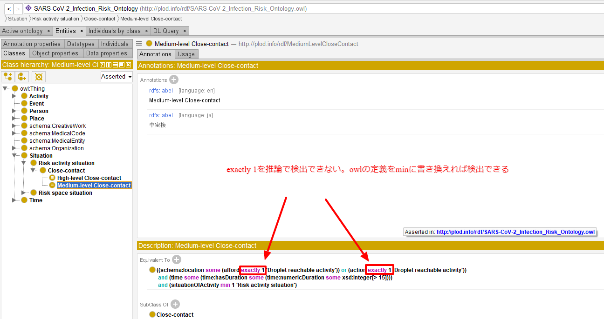
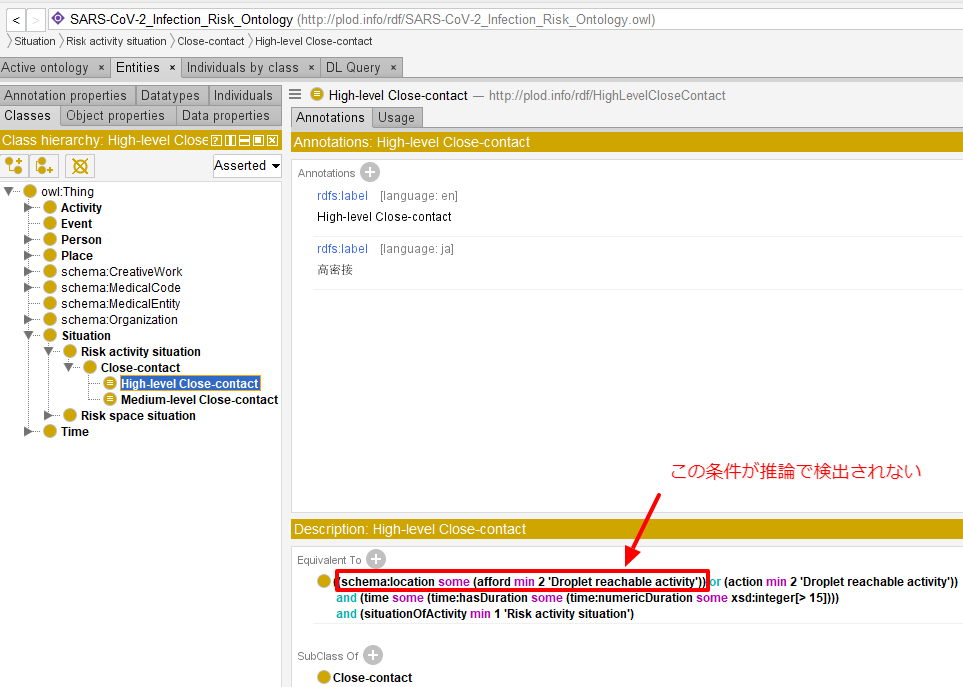

## 調査結果概要
[PLOD](https://github.com/PLOD-info/PLOD)のオントロジーに基づき表現された感染症患者やその接触者の行動記録データについて、[Owlready2](https://owlready2.readthedocs.io)という推論ライブラリを用いて推論結果の妥当性や、推論に必要な時間、マシンリソースの評価を行った。  

Owlready2はオントロジーに表現されたいくつかの制約を推論できなかった。また、評価対象データトリプル数の線形の増加に対して処理時間は指数関数的に大きくなり、1000の行動記録に対しては10分以上の処理時間を要し、10000の行動記録では10時間以上推論結果が返却されない結果となった。ただし、この処理時間の増加傾向はオントロジーの内容に依存すると思われ、接触時間に数値条件を設定しているかどうかで行動記録数と処理時間の傾きには差が見られた。
現実の感染症危機管理が取り扱うデータに対しては、本ライブラリの実用には最適化されたオントロジーと無理のないデータ数での運用が求められる。

## 環境構築
提供されたlinux環境へ、pyenvでpythonのインストールを行った。
しかし、pythonに同梱されるSQLiteは3.7.17であり、SQLiteのwith句がサポートされていない。
with句は SQLiteのバージョンが[3.8.3](https://www.sqlite.org/changes.html)以上で使用できる。
```bash
[infolounge@plod01 PLOD]$ python
Python 3.9.5 (default, Jun 11 2021, 19:21:50)
[GCC 4.8.5 20150623 (Red Hat 4.8.5-44)] on linux
Type "help", "copyright", "credits" or "license" for more information.
>>> import sqlite3
>>> sqlite3.version
'2.6.0'
>>> sqlite3.sqlite_version
'3.7.17'
```
そこで、`~./bashrc`に対し
```bash  
export LD_LIBRARY_PATH=/usr/local/lib:$LD_LIBRARY_PATH
```
を追記し、動的にライブラリパスを指定することで必要なsqliteのバージョンを指定した。

## 調査手順
下記レポジトリのtestディレクトリ配下に、試験に使用したスクリプト群を配置した。  
https://github.com/InfoLoungeLLC/PLOD/tree/generate_testdata/test

下記のCSVにテストケースの一覧を定義した。  
https://github.com/InfoLoungeLLC/PLOD/blob/generate_testdata/test/test_cases.csv  
それぞれのテストケースは、密接・密閉・密集の3要素のうち一要素のみを高・中・低の3通りに変化させ、その他の要素を固定し、また、その生成数の全体における割合を指定している。  
例えば、テストケースの1番においては高密接かつ高密閉かつ高密集な行動記録データを10%、中密接かつ高密閉かつ高密集な行動記録データを20%、低密接かつ高密閉かつ高密集な行動記録データを70%生成するという想定をした。 さらに、密接・密閉・密集の条件を共通とした上で行動記録データの総数を100, 500, 1000と変化させることで、データの総量に対する推論の所要時間変化を計測した。

それぞれのテストケースに応じた行動記録データは
https://github.com/InfoLoungeLLC/PLOD/blob/generate_testdata/test/test_main.py  
によって生成し、生成されたRDFとオントロジーを組み合わせてOwlready2の推論を実行し、
Owlready2が推論した密接・密閉・密集の3要素の数を同ディレクトリの`results.csv`に出力した。
実行コマンドは
```bash
python test_main.py
```
である。なお、
```bash
python test_main.py --noDuration
```
のオプションを付与することで、接触時間に数値条件を設定していないオントロジーの使用を指定可能とし、異なるオントロジーを使用することによる推論結果、推論時間の違いを記録した。

`results.csv`は、例えば下表のような記述となる。

|テストケース番号|テストデータ数|Generated HighLevelCloseContact|Generated HighLevelClosedSpace|Generated HighLevelCrowding|Generated MediumLevelCloseContact|Generated MediumLevelClosedSpace|Generated MediumLevelCrowding|Reasoned HighLevelCloseContact|Reasoned HighLevelClosedSpace|Reasoned HighLevelCrowding|Reasoned MediumLevelCloseContact|Reasoned MediumLevelClosedSpace|Reasoned MediumLevelCrowding|処理時間[秒]|
|---|---|---|---|---|---|---|---|---|---|---|---|---|---|---|
|1|100|10|100|100|20|0|0|9|100|100|13|0|0|8.794224739074707|
|2|500|50|500|500|200|0|0|30|500|500|148|0|0|409.8590896129608|
|3|1000|100|1000|1000|600|0|0|65|1000|1000|437|0|0|2561.254375219345|

この例におけるテストケース1の場合は、10の高密接な行動記録データを生成した(Generated HighLevelCloseContact)が、Owlready2によって推論された高密接な行動記録データは9つ(Reasoned HighLevelCloseContact)だったことを示している。  
また、推論に要した時間を処理時間の列に記載した。  

更に、推論中の検証機のメモリ使用率、メモリ使用量を5秒毎に測定し、memory_resultディレクトリ配下に`memory_case_1_datacount_100.csv` のようなファイル名で配置した。このファイル名であれば、テストケース1番のメモリ使用率、使用量を示す。
`memory_case_1_datacount_100.csv`は、例えば下表のような記述となる。
|TIME_STAMP|Java Memory Usage (%)|Java Memory Usage (MB)|
|---|---|---|
|03:35:38:1629657338+09:00|0.1|515.747|
|03:35:43:1629657343+09:00|0.1|515.747|
|03:35:48:1629657348+09:00|0.1|515.747|

テストケースごとの生成された行動記録（RDF）はrdfディレクトリ配下に配置した。また、Owlready2が推論に使用したsqliteの永続化ファイルをsqliteディレクトリ配下に出力した。


## 調査結果
接触時間に数値条件を設定したオントロジーを使用したテスト結果を`test.tar.gz`に、接触時間に数値条件を設定していないオントロジーを使用したテスト結果を`test_noDuration.tar.gz`として提出した。

### 推論の妥当性
高密接・中密接の推論において、テストケースが生成した数よりも推論された数が少なくなる結果が得られた。その理由には2つの原因が考えられ、オントロジーの問題ではなく、Owlready2の推論性能によるものと見ている。
原因の一つはオントロジーそのものを書き換えることで回避し、もう一つは解消できなかった。
- 原因1: `owl:qualifiedCardinality`が解釈できない

今回使用したオントロジーでは、あるプロパティの出現回数を`owl:qualifiedCardinality`にて規定していた。
```xml
<owl:qualifiedCardinality rdf:datatype="http://www.w3.org/2001/XMLSchema#nonNegativeInteger">1</owl:qualifiedCardinality>
```
このオントロジーに生成したテストデータのRDFを手動でマージし、[Protege](https://protege.stanford.edu/)に読み込ませ推論を行ったところ、密接に関する推論数はOwlready2の推論結果と一致した。ProtegeはOwlready2と同様に内部の推論エンジンに[HermiT](http://www.hermit-reasoner.com/java.html)を使用しているため、推論の挙動は基本的に一致することが見込まれる。  
Protege上でオントロジーの定義を書き換えながら推論数の変化を探ったところ、`owl:qualifiedCardinality`の記述を`owl:minQualifiedCardinality`に書き換えることでテストデータが生成した密接に関する行動記録数と、推論数が一致した。よって、オントロジーをこのように変更することで課題を迂回することとした。



- 原因2: 複雑な制約の推論にうまくいかないものがある  
下記画像に示したように、"schema:locationが存在し、それの指すリソースの型がplod:DropletReachableActivityをplod:affordするプロパティを2つ以上持っている"ような複雑な制約の推論に失敗する挙動が見られた。これは、オントロジーの軽微な書き換えでは対応できず、推論結果にそのまま影響を残すこととなった。




### 推論に要するリソース、時間
`results.csv`の処理時間の列を見ると、密接・密閉・密集の条件は共通として行動記録データの総数を100, 500, 1000と変化させた場合に、それぞれの推論所要時間は10秒以下,数十秒から300秒程度,数十秒から数千秒程度の範囲で連動する様子が記録された。また、総数を10,000にすると、単一のケースでも10時間以上結果が得られなかった。データ総数の増加に対して、推論に必要な時間は非線形、指数関数的な増大を見せると考えられる。  
一方で、接触時間に数値条件を設定していないオントロジーを使用した場合には、データ数の増加に対する処理時間の増大は相対的に小さくなった。テストケースによっては、接触時間に数値条件を設定したオントロジーとそうでないオントロジーで10分の一程度の推論時間となるケースもあった。しかし、数値条件を設定していないオントロジーにおいても、データ総数を10,000にすると10時間以上結果が返却されなかった。

メモリ使用率、使用量については、安定した計測結果を得られなかった。検証機においては、概ね推論に要するメモリの使用率0.1%であり、500MB程度の使用量で横ばいであったが、テストケースによってはメモリ使用率が100%を超えるという記録となった。メモリ使用率はtopコマンドの出力を文字列処理して整形して使用しており、なんらか不安定な挙動があったことが懸念される。  

## 結論
Owlready2が正しく推論を行えるようなオントロジーに調整し、データ総数にも配慮しながら活用することで本ライブラリの実用は可能と考えられる。一方で、本ライブラリは広くどのようなオントロジー、データにも活用できる性能ではないと見込まれる。
